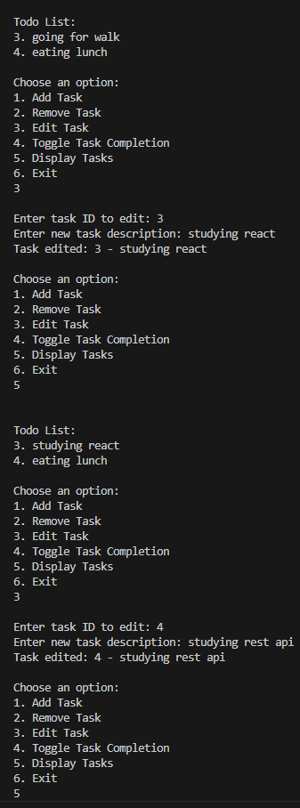
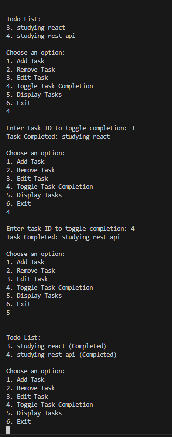

# Todo List CLI (TypeScript)

A simple command-line Todo application built with TypeScript. This application allows users to manage their tasks interactively using the terminal.

## Features

- Add a new task
- Remove a task by ID
- Edit a task's description
- Toggle task completion status
- Display all tasks
- Interactive CLI for user-friendly operation

## Prerequisites

Ensure you have the following installed on your system:

- [Node.js](https://nodejs.org/) (v14+ recommended)
- TypeScript (`npm install -g typescript`)

## Installation

1. Clone the repository:
   ```sh
   git clone https://github.com/yourusername/todo-list-ts.git
   cd todo-list-ts
   ```
2. Install dependencies:
   ```sh
   npm install
   ```
3. Compile the TypeScript files:
   ```sh
   tsc
   ```
4. Run the application:
   ```sh
   node dist/todo.js
   ```

## Usage

Upon running the script, you will be prompted to choose an option from the menu:

1. **Add Task** - Enter a task description to add a new task.
2. **Remove Task** - Enter the ID of the task to remove.
3. **Edit Task** - Modify an existing task's description.
4. **Toggle Task Completion** - Mark a task as completed or incomplete.
5. **Display Tasks** - View the list of all tasks.
6. **Exit** - Close the application.

## Example

```sh
Choose an option: 
1. Add Task
2. Remove Task
3. Edit Task
4. Toggle Task Completion
5. Display Tasks
6. Exit
```

### Adding a Task
```
Enter task to add: Buy groceries
Added: Buy groceries
```

### Displaying Tasks
```
Todo List:
1. Buy groceries
```

### Toggling Completion
```
Enter task ID to toggle completion: 1
Task Completed: Buy groceries
```

## Screenshots

### Adding a Task
![Add Task] (screenshots/add-tasks.png)

### Remove Tasks


### Toggling Completion


## Project Structure

```
📦 todo-list-ts
 ┣ 📂 src            # TypeScript source files
 ┃ ┗ 📜 todo.ts      # Main application file
 ┣ 📂 dist           # Compiled JavaScript files
 ┃ ┗ 📜 todo.js      # Compiled main application file
 ┣ 📂 screenshots    # Screenshots for documentation
 ┣ 📜 package.json   # Node.js dependencies
 ┣ 📜 tsconfig.json  # TypeScript configuration
 ┣ 📜 README.md      # Project documentation
 ┗ 📜 .gitignore     # Files to ignore in Git
```

## License

This project is licensed under the MIT License.

## Author

Your Name - [GitHub Profile](https://github.com/yourusername)

